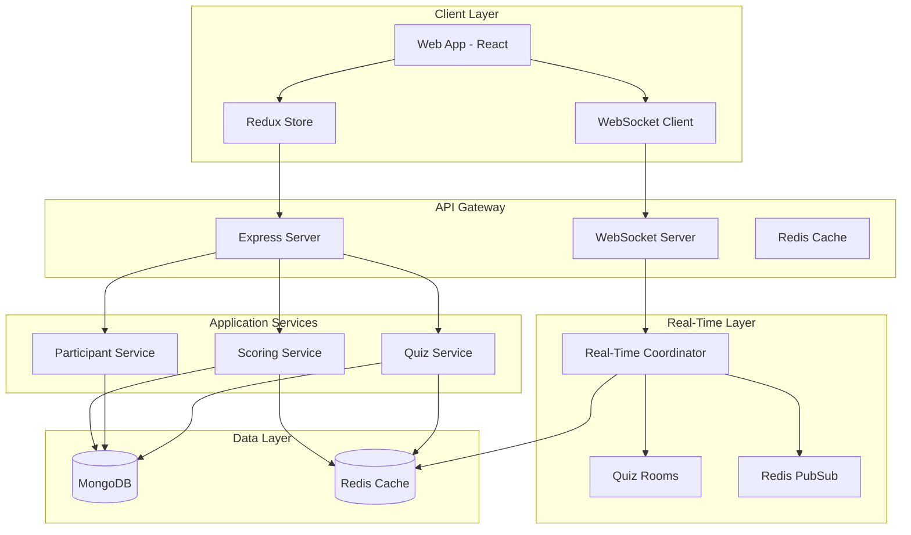
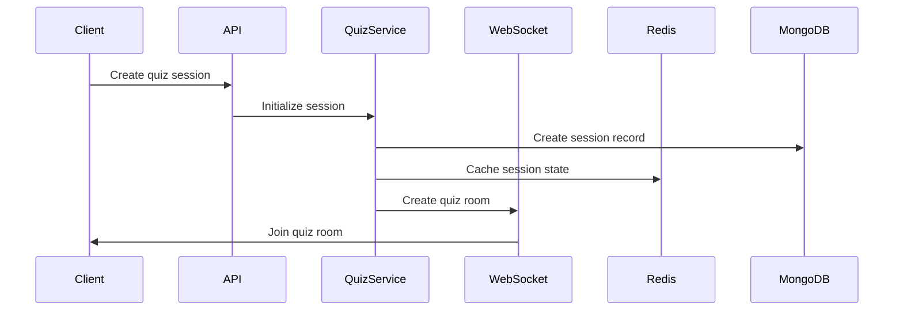
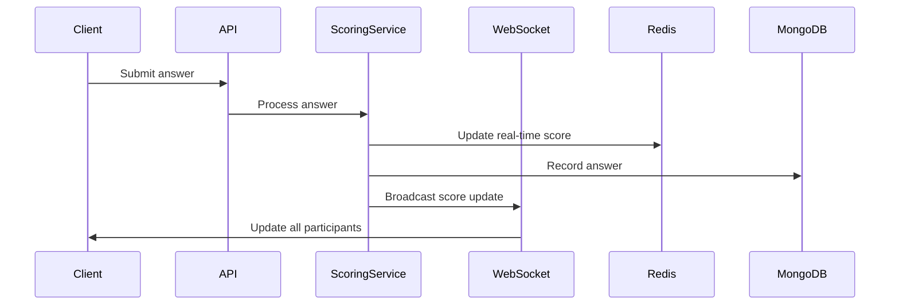

# Real-Time Vocabulary Quiz System Architecture

## Architecture Overview

## Component Descriptions

### 1. Client Layer
- **Web Application**: React-based SPA
  - Anonymous user support with localStorage-based user IDs
  - Real-time score updates and participant tracking
  - Live leaderboard with participant progress
- **Redux Store**: State management
  - Quiz state
  - Session management
  - Participant data
- **WebSocket Client**: Real-time communication
  - Quiz room management
  - Score broadcasting
  - Participant status updates

### 2. API Gateway
- **Express Server**: HTTP API handling
  - Quiz management
  - Session control
  - Score submission
- **WebSocket Server**: Real-time event handling
  - Quiz room coordination
  - Participant tracking
  - Score broadcasting
- **Redis Cache**: Performance optimization
  - Quiz data caching
  - Session state caching
  - Participant data caching

### 3. Application Services

#### Quiz Service
- **Core Features**:
  - Quiz creation and retrieval
  - Session management
  - Answer validation
  - Score calculation
- **Implementation**:
  - MongoDB for quiz storage
  - Redis for caching
  - Real-time updates via WebSocket

#### Participant Service
- **Core Features**:
  - Anonymous user management
  - Session participation tracking
  - Real-time status updates
- **Implementation**:
  - In-memory participant tracking
  - WebSocket-based updates
  - Redis for state persistence

#### Scoring Service
- **Core Features**:
  - Real-time score calculation
  - Progress tracking
  - Leaderboard management
- **Implementation**:
  - Time-based scoring
  - Difficulty multipliers
  - Instant score broadcasting

### 4. Real-Time Layer

#### Real-Time Coordinator
- **Features**:
  - Quiz room management
  - Participant synchronization
  - Score broadcasting
- **Implementation**:
  - Socket.IO for WebSocket handling
  - Room-based participant grouping
  - Event-driven architecture

#### Quiz Rooms
- **Features**:
  - Quiz-specific participant groups
  - Real-time score updates
  - Participant status tracking
- **Implementation**:
  - In-memory room management
  - Participant mapping
  - Event broadcasting

### 5. Data Layer

#### MongoDB
- **Collections**:
  - Quizzes: Quiz content and metadata
  - Sessions: Active and completed sessions
  - Participants: User participation records
- **Features**:
  - Document-based storage
  - Session state persistence
  - Historical data tracking

#### Redis Cache
- **Features**:
  - Quiz data caching
  - Session state caching
  - Real-time data storage
- **Implementation**:
  - Key-value storage
  - TTL-based cache invalidation
  - PubSub capabilities

## Data Flow Examples

### 1. Quiz Session Initialization

### 2. Real-Time Answer Submission

## Implementation Details

### Anonymous User System
- Client-side user ID generation
- LocalStorage persistence
- Session-based participation tracking

### Real-Time Score Updates
- Quiz-based room system
- Immediate score broadcasting
- Progress tracking for all participants

### Caching Strategy
- Quiz content caching
- Session state caching
- Real-time data synchronization

### Error Handling
- Graceful error recovery
- Session state preservation
- Real-time error broadcasting

## Current Implementation

The current implementation includes:
1. Backend Express server with WebSocket support
2. MongoDB integration for data persistence
3. Redis caching for performance
4. Anonymous user system
5. Real-time quiz rooms
6. Live score updates
7. Basic error handling and monitoring

For future scalability improvements, see [SCALABILITY.md](SCALABILITY.md)
