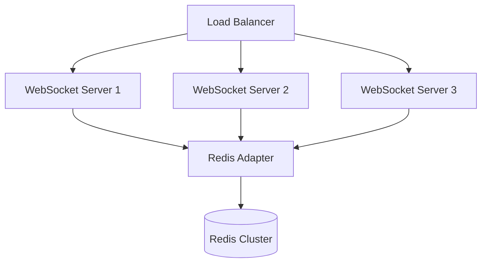
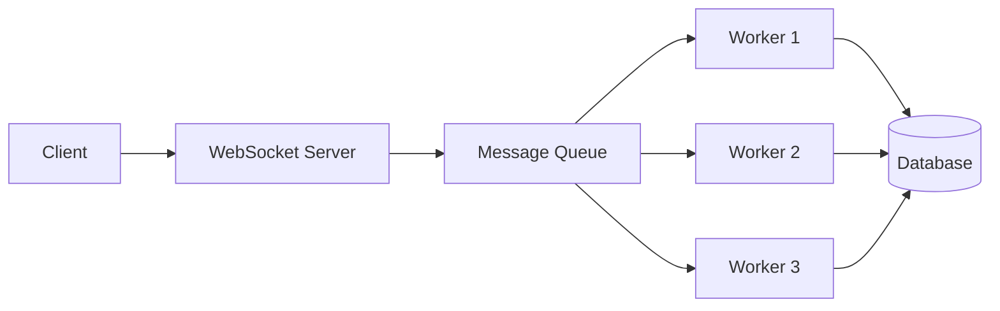
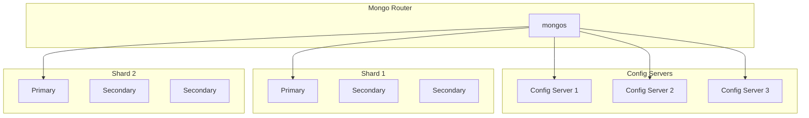
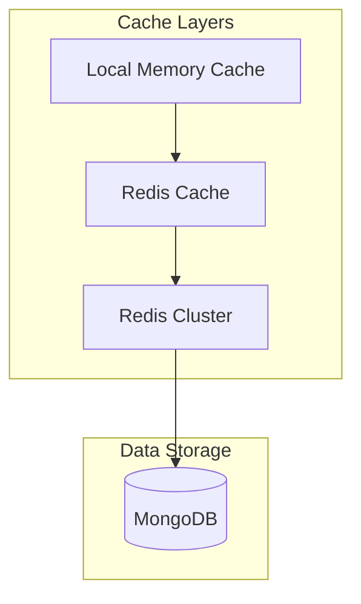
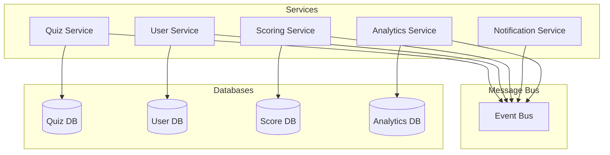
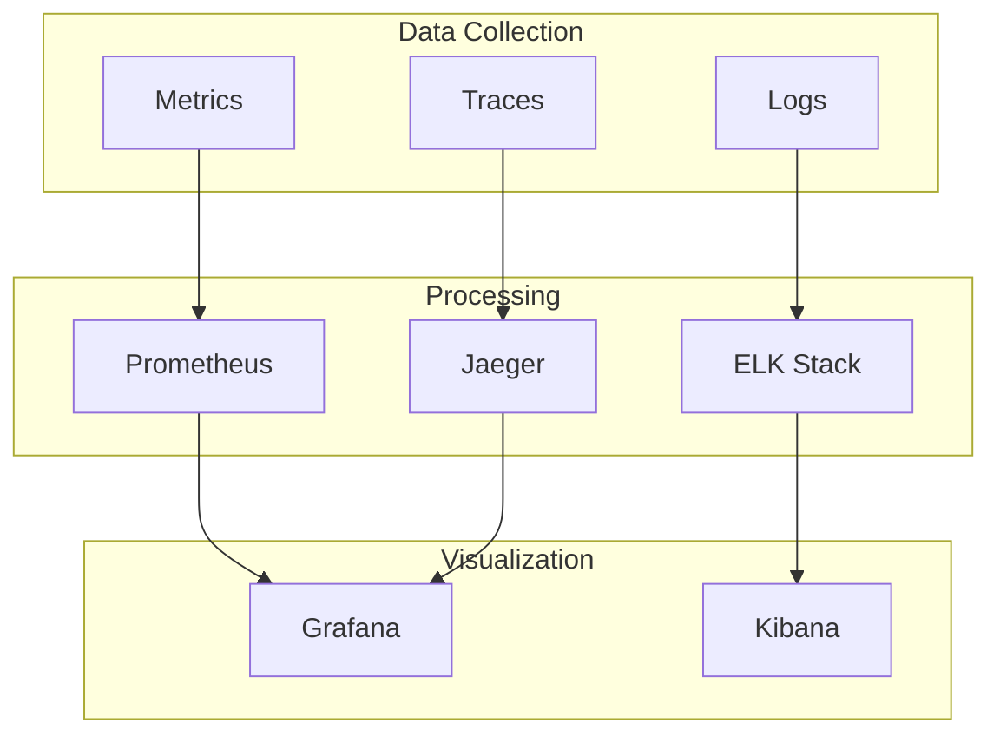

# Future Scalability Improvements

## Current System Limitations

1. **WebSocket Scalability**
   - Single WebSocket server instance
   - Limited concurrent connection handling
   - No horizontal scaling support

2. **Database Performance**
   - Single MongoDB instance
   - No sharding implementation
   - Basic caching strategy

3. **Real-time Message Handling**
   - Direct WebSocket communication
   - No message queuing
   - Limited message persistence

## Proposed Solutions

### 1. WebSocket Clustering

**Implementation Steps:**
1. Implement Socket.IO Redis Adapter
2. Set up WebSocket server clustering
3. Configure sticky sessions in load balancer
4. Implement connection state management

**Benefits:**
- Horizontal scaling of WebSocket connections
- Improved fault tolerance
- Better load distribution
- Session persistence across nodes

### 2. Message Queue System

**Implementation Steps:**
1. Set up Redis Pub/Sub or Apache Kafka
2. Implement message producers and consumers
3. Add message persistence
4. Configure message routing and filtering

**Benefits:**
- Asynchronous message processing
- Better handling of traffic spikes
- Improved system reliability
- Message persistence

### 3. Database Sharding

**Implementation Steps:**
1. Set up MongoDB sharding
2. Define shard keys
3. Implement data migration
4. Configure replica sets

**Benefits:**
- Horizontal scaling of data
- Better read/write distribution
- Improved query performance
- Data locality

### 4. Caching Strategy Enhancement

**Implementation Steps:**
1. Implement multi-layer caching
2. Set up Redis Cluster
3. Define cache invalidation strategies
4. Configure cache synchronization

**Benefits:**
- Reduced database load
- Faster response times
- Better cache hit rates
- Distributed caching

### 5. Microservices Architecture

**Implementation Steps:**
1. Break down monolithic service
2. Implement service discovery
3. Set up API gateway
4. Configure service communication

**Benefits:**
- Independent scaling
- Better fault isolation
- Easier maintenance
- Technology flexibility

## Implementation Priority

1. **Phase 1: Foundation (1-2 months)**
   - WebSocket clustering
   - Basic message queue
   - Enhanced caching

2. **Phase 2: Data Layer (2-3 months)**
   - Database sharding
   - Cache strategy implementation
   - Data migration

3. **Phase 3: Architecture (3-4 months)**
   - Microservices transition
   - Service mesh implementation
   - API gateway enhancement

## Monitoring and Metrics

### Key Metrics to Track
1. **Performance**
   - WebSocket connection count
   - Message latency
   - Cache hit rates
   - Database query times

2. **Scalability**
   - Resource utilization
   - Connection distribution
   - Message queue depth
   - Shard balance

3. **Reliability**
   - Error rates
   - System uptime
   - Message delivery success
   - Failover effectiveness

### Monitoring Implementation

## Cost Considerations

1. **Infrastructure Costs**
   - Additional server instances
   - Database cluster costs
   - Message queue service
   - Monitoring tools

2. **Development Costs**
   - Engineering time
   - Testing resources
   - DevOps support
   - Training

3. **Operational Costs**
   - Increased maintenance
   - Monitoring overhead
   - Support requirements
   - Backup and recovery

## Risk Mitigation

1. **Technical Risks**
   - Gradual implementation
   - Comprehensive testing
   - Rollback plans
   - Performance benchmarking

2. **Operational Risks**
   - Documentation
   - Team training
   - Monitoring setup
   - Incident response plans

3. **Business Risks**
   - Cost control
   - Service continuity
   - Data integrity
   - User experience

## Success Metrics

1. **Performance Goals**
   - 99.9% uptime
   - <100ms message latency
   - >95% cache hit rate
   - <1s query response time

2. **Scalability Goals**
   - Support 100k concurrent users
   - Handle 1M messages/minute
   - Process 10k quiz submissions/second
   - Maintain performance under load

3. **Business Goals**
   - Reduced operational costs
   - Improved user satisfaction
   - Increased system reliability
   - Better maintainability
